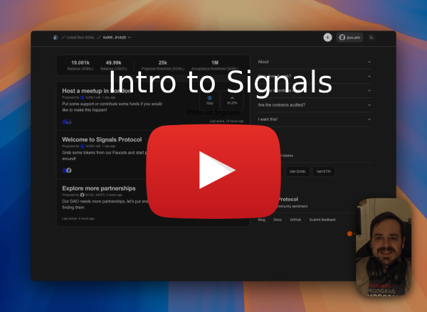

# 📡 Signals: Discover community sentiment

## Getting started

### Local development

```shell
# tty0 (root)
# Produce a block every 5 secs
anvil --block-time 5

# tty1 (root)
# Setup development environment (uniswap, signals, txns etc)
bash scripts/dev.sh

# tty1 (app/indexers)
# Start indexer
yarn dev
```

#### A project for the RnDAO Arbitrum CollabTech Hackathon

***

[ Click here to watch our video.](https://www.youtube.com/watch?v=JKchm2MFXWA)

The live demo can be found at [https://signals.testnet.lighthouse.cx/](https://signals.testnet.lighthouse.cx/)

## Description

**Existing on-chain voting systems have many weaknesses.** Popular systems for submitting proposals to be voted on are quite rigid and initimidating, which results in a lot of emphasis being put on preparing the perfect proposal before submission. Many voters won't give honest feedback until it comes time to take an official vote, which makes it hard for proposers to know which initiatives would receive support and which details should be included. Whales and influencers can hold outsized sway over voting, undermining the democratic process.

**Signals attempts to solve this problem by allowing on-chain governance groups to discover which initiatives are most important to the community.** Community members can submit "initiatives" (either draft proposals or just rough themes and ideas) and other community members can show support for which initatives they are most in favour of. A token-locking mechanism allows even small token holders to compete with the whales on issues they are most passionate about, and a rewards system makes it possible to incentivize participation in the process.

**The resulting benefits are:**

* Community leaders can gauge community sentiment for specific iniatives before moving to a vote
* Potential proposers can present multiple ideas and see what sticks most, without being obligated to take any specific action
* Community members who want to get involved but don't know where to invest their time and energy can see what activities the community would appreciate most
* Community members who have good ideas but no ability to execute can still contribute to the ideation process

**Isn't this just a new form of voting?**

Signals is not a voting or decision-making system. Initiatives that get the most support are not obligated to be actioned, and it is up to the community to decide how they will best make use of the information that is surfaced from this tool.

**For more details on the problems and how Signals solves them, read our draft [whitepaper](WHITEPAPER.md).**

## How it works

* Signals operates completely on-chain, on the Arbitrum network. A community can deploy their own copy of the smart contract using our factory, and configure it to use any ERC20 token to control access and participation. The token could be a governance token, stablecoin, or even a specific token created specificially for the purpose of participating in this platform.

* Community members who hold a minimum amount of the specified token are allowed to submit initiatives, containing a title and body.

* Any community member who holds any amount of the token can then "support" an initiative by locking up a portion of their tokens in favor of that initiative. Each supporter can decide for themselves how many tokens they are willing to lock up, and for how long. A longer lockup duration increases the weight of the supporter's contribution, meaning someone who locks up a small amount of tokens for a long time could have just as much impact as a whale who locks up a large amount of tokens for a small amount of time. As the name implies, tokens that have been locked up are transfered to the smart contract and can not be withdrawn until the lock expires or the initiative is closed.

* Our user-friendly web interface shows all initiatives ordered by the weight each has received, surfacing at a glance which initiatives have the most support from the community.

* The weight bonus gained from longer lockups decays over time, which keeps initiatives timely. An issue which gains a lot of support all at once rises much higher than an issue that gains small amounts of support over a long period of time.

* Any initiative which receives a total amount of support exceeded a specified threshold can then be "accepted" by the community, in which case it is removed from the active initiatives list and all supporters are immediately refunded the tokens they have locked up in support of that initiative. It is up to the community to decide what action to take on accepted initiatives.

* Any initative which has not received any support after a specified period of inactivity (e.g. 60 days) is considered abandoned and can be "expired", which removes the initiative from the active initiatives list and refunds all supporters who have locked up tokens in support.

* Once a token lock has reached the end of its lockup duration, the supporter can withdraw their tokens (removing support from the initiative) or leave their tokens deposited, which will continue to provide support for that initiative (but without any lockup bonus to the weight).

## Rewards

Incentives can be a helpful way to encourage community members to participate. We have added a rewards system which allows anyone to deposit tokens into escrow, which get paid out to supporters of a particulare initiative if it is accepted. This allows groups or individuals who are passionate about a particular initiative to not only support it with their tokens, but also contribute money towards getting others to support the initative as well.

## Installation

This repo contains an `apps/` directory which contains our source code. In this directory you will find:

1. `contracts`: Our solidity smart contracts [Docs](apps/contracts/README.md)
2. `interface`: Our next.js web UI for interacting with the contracts [Docs](apps/interface/README.md)
3. `simulations`: A start at running monte carlo simulations to prove the effectiveness of different weight curves (WIP - ignore for now)

Each of these folders has its own readme for more technical details.

## Usage

Visit [https://signals.testnet.lighthouse.cx/](https://signals.testnet.lighthouse.cx/) to explore the protocol.

* Grab some testnet ETH at <https://docs.arbitrum.io/for-devs/dev-tools-and-resources/chain-info#faucets>
* You can then use our built in faucet to claim some `SGNL` (our governance token) and `Mocked USDC` (our reward token) to use on the frontend.
