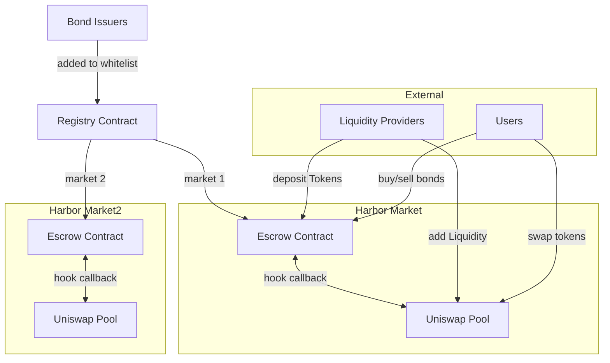

# Overview

```mermaid
graph TB
        Registry[Registry Contract]
        Issuers[Bond Issuers]
        Registry -->|market 1| Escrow
        Registry -->|market 2| Escrow2
        Issuers -->|added to whitelist| Registry
    subgraph "Harbor Market"
        Escrow[Escrow Contract]
        Pool[Uniswap Pool]
        Escrow <-->|hook callback| Pool
    end
    subgraph "Harbor Market2"
        Escrow2[Escrow Contract]
        Pool2[Uniswap Pool]
        Escrow2 <-->|hook callback| Pool2
    end
    subgraph "External"
        Users1[Users]
        Users2[Liquidity Providers]
        Users2 -->|deposit Tokens| Escrow
        Users2 -->|add Liquidity| Pool
        Users1 -->|buy/sell bonds| Escrow
        Users1 -->|swap tokens| Pool
    end
```
