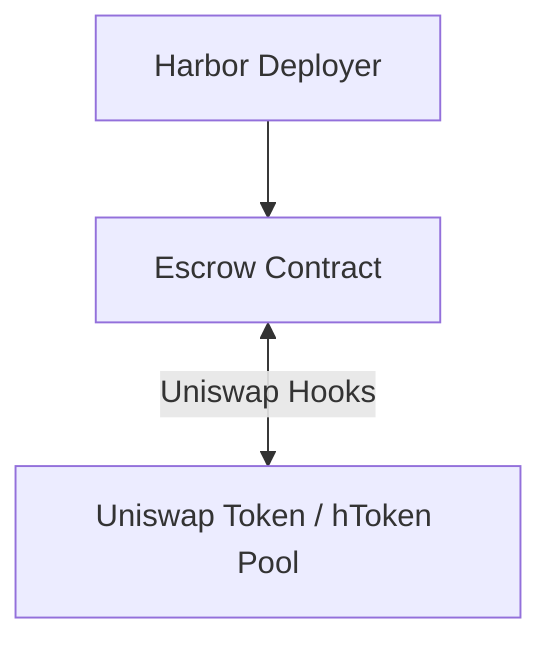
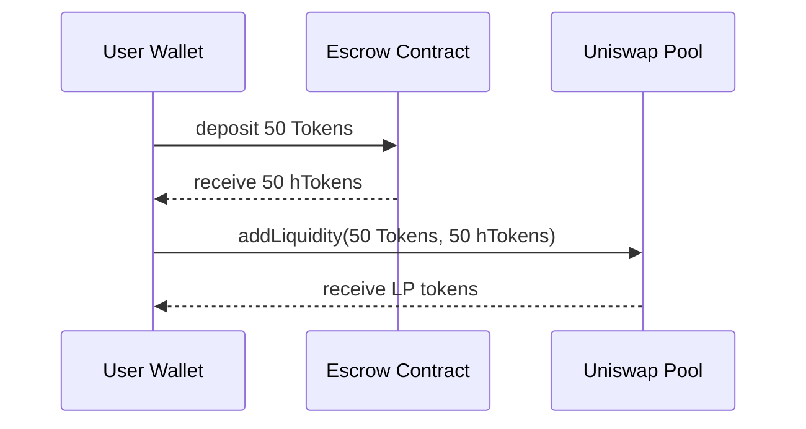

# Escrow

The Harbor system is centered around an escrow contract which holds collateral (liquid tokens and bonds) for a single underlying ERC20 asset (hereafter called the `Token`).

When the escrow contract receives a collateral asset, it issues Harbor tokens (`hToken`) representing the value of the collateral at a 1:1 ratio. Harbor tokens use the same ticker as the underlying asset, with the prefix `h` (e.g. `UNI` -> `hUNI`).

- Users can __wrap__ liquid tokens into the escrow contract to receive `hTokens`, and __unwrap__ `hTokens` for `Tokens` at any time.

- Harbor [markets](/components/markets) can receive NFT bonds, backed by a whitelisted issuer, in which case the escrow contract will issue a number of `hTokens` equal to the minimum guaranteed redemption value (face value) of the bond.
- `hTokens` are used to purchase immature bonds from the market.

:::info
The escrow contract guarantees that every `hToken` is backed 1:1 by a `Token` held in escrow, either directly as liquid tokens or indirectly via bonds.
:::

### Uniswap Pool

Each escrow contract is paired with a Uniswap V4 pool, which allows users to swap `hTokens` for `Tokens`. The pool is connected to the escrow contract using Uniswap V4 Hooks.

The pool is intended to always trend towards a __1:1 price ratio__, which is maintained by market arbitrage forces:

- If the price of the pool becomes unbalanced with insufficient `Tokens`, the escrow contract can use any liquid `Tokens` it holds to buy back `hTokens` from the pool.

- If the price of the pool becomes unbalanced with insufficient `hTokens`, any user can deposit `Tokens` into the escrow contract to receive `hTokens`, which they can then sell into the pool to take advantage of the arbitrage opportunity.

### Adding Liquidity

If a user holds `Tokens` and would like to add liquidity to the pool (assuming the price is currenlty at 1:1), they can deposit half of their tokens into the escrow contract to receive `hTokens`, and then add both `Tokens` and `hTokens` to the pool.

__Assuming the user has 100 `Tokens`:__

