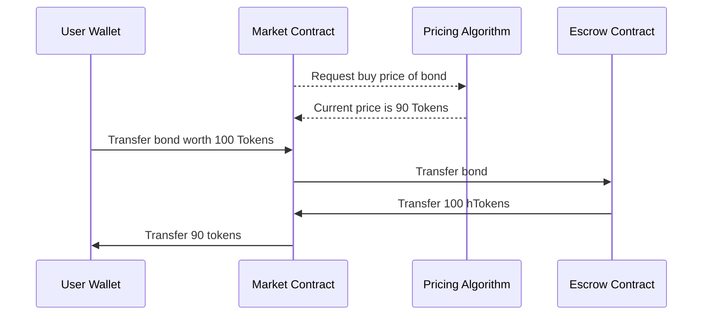
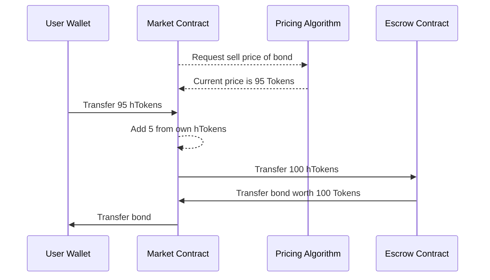

# Markets

The [Escrow](/components/escrow) contract, is paired with a `Harbor market` (A Uniswap v4 Hook) which provides an interface for end users to buy/sell bond NFTs from/into the escrow.

The _market_ makes use of an on-chain pricing algorithm to dynamically set the price at which it will buy and sell bonds, based on their attributes.

The _market_ keeps track of which bonds it has bought from users and the price paid, and utilizes its own logic to resell bonds to generate profit on behalf of liquidity providers.

## Example Flow

Imagine a user wants to sell a bond that contains 100 locked `Tokens`. Based on the remaining time to maturity, the pricing algorithm determines the market should be willing to buy the bond for 90 `Tokens` and sell the bond for 95 `Tokens`.

__A user sells the bond into the market:__

At this point, the user has sold their bond for 90 `hTokens`. The NFT and its underlying 100 `Tokens` is now in escrow, with 10 `hTokens` held by the market.

__Another user buys the bond from the market:__

At this point, the user has purchase the bond for 95 `hTokens`. The market has added 5 of its 10 tokens to the user's 95 to redeem the bond from the escrow. The user now owns the bond, and the market has generated 5 `hTokens` in profit.

The profit generated can be paid out to liquidity providers, who can use it to redeem liquid tokens from the escrow contract.
