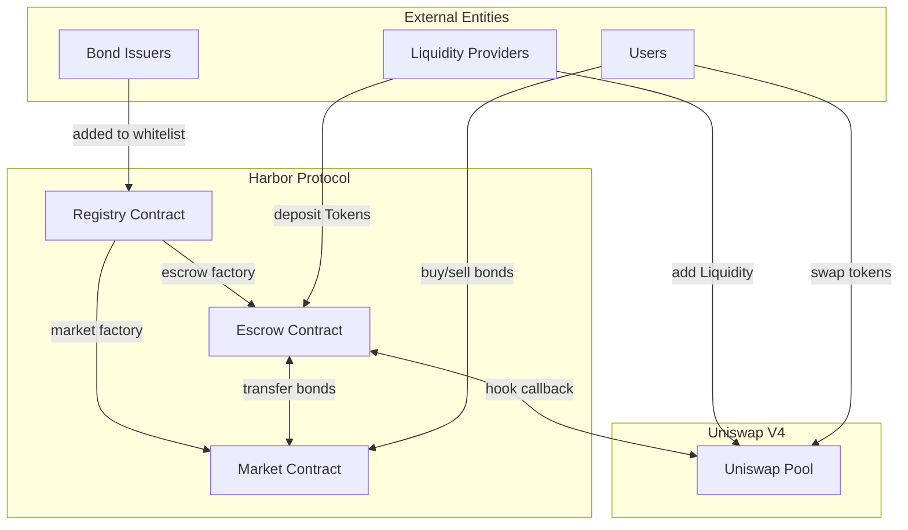
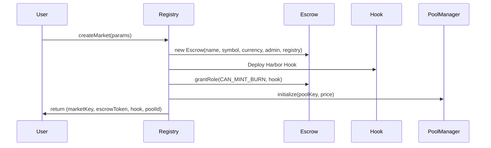
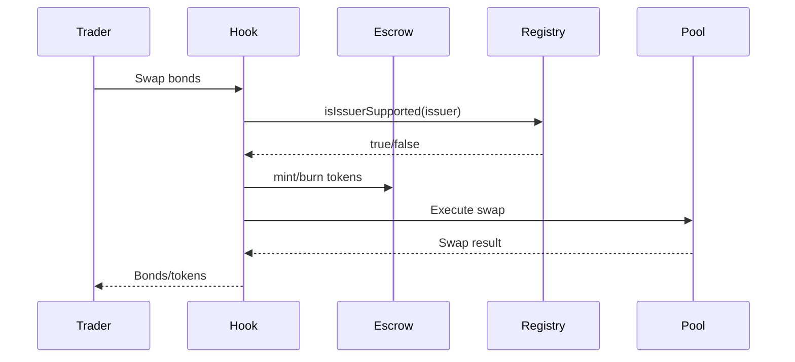

## Overview



## Data Flow

### Market Creation Flow



### Bond Trading Flow



## Security Model

### Access Control Hierarchy

```
Registry (Admin)
├── Market Creation
├── Issuer Management
└── Infrastructure Coordination

Escrow (Role-Based)
├── CAN_DEPOSIT_WITHDRAW → Harbor Hook
├── CAN_MINT_BURN → Harbor Hook
└── DEFAULT_ADMIN_ROLE → Registry

Harbor Hook
├── Bond Trading (Public)
├── Liquidity Management (Public)
└── Token Operations → Escrow
```

### Trust Assumptions

1. **Registry Admin**: Trusted to manage issuers and system parameters
2. **Bond Issuers**: Must be validated and added to registry before use
3. **Harbor Hook**: Granted specific roles for token operations
4. **Uniswap V4**: Underlying AMM infrastructure assumed secure

## Integration Points

### With Uniswap V4

- Uses Pool Manager for pool initialization and management
- Hook integrates with swap, liquidity, and initialization flows
- Dynamic fee structure based on trading patterns

### With Bond Issuers

- Standardized `IBondIssuer` interface for compatibility
- Bond validation through `BondAdapter` utility
- Registry-managed whitelist for supported issuers

### With External Systems

- ERC20 compatibility for wrapped tokens
- OpenZeppelin AccessControl for role management
- Upgradeable patterns for future enhancements

## Design Principles

1. **Modularity**: Clear separation between Registry, Escrow, and Hook
2. **Security**: Role-based access control and validation at every level
3. **Composability**: Standard interfaces for integration with other protocols
4. **Efficiency**: Atomic operations and gas-optimized implementations
5. **Extensibility**: Plugin architecture for new bond types and pricing models

## Next Steps

- [Registry System](/architecture/registry) - Deep dive into market management
- [Escrow Contract](/architecture/escrow) - Token and bond operations
- [Harbor Hook](#TODO) - Trading implementation
