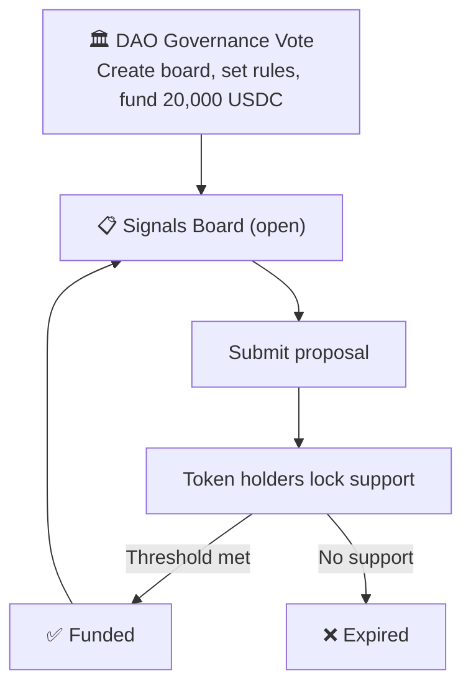

# Capital Allocation

## Treasuries need better signal than snapshot votes

Most DAOs allocate treasury funds through binary votes: a proposal passes or it doesn't. This tells you whether a quorum showed up. It tells you almost nothing about *relative priority*. When a community has twenty worthy funding proposals and budget for five, a yes/no vote on each one produces no ranking and no tradeoff information.

Signals solves this by making support expensive. Token holders lock governance tokens behind the funding proposals they want to see capitalized. Because locked tokens can't simultaneously back multiple initiatives, every allocation decision carries **opportunity cost**. The result is a ranked signal of where the community actually wants capital deployed.

> Support that costs nothing reveals nothing. Locked tokens are the cost.

## Running an RFP through a Signals board

The DAO creates a board scoped to a specific RFP. Service providers submit initiatives describing their approach, timeline, and cost. Token holders lock tokens behind the provider they want to see win. Because tokens locked behind one proposal are *unavailable for another*, supporters have to pick. The **acceptance threshold** acts as the selection bar. The first proposal to cross it wins the RFP.

| Parameter | Value | Rationale |
|-----------|-------|-----------|
| `lockInterval` | 1 day | Daily granularity for a multi-week evaluation period |
| `maxLockIntervals` | 180 (6 months) | Ceiling high enough for strong conviction signals |
| `decayConfig` | Linear, moderate rate | Prevents early submissions from coasting on stale support |
| `releaseLockDuration` | Duration of the RFP | Prevents token recycling between competing bids |
| `closesAt` | End of RFP window | Fixes the evaluation period |
| `acceptanceCriteria` | Percentage of supply | Scales with participation |

The `releaseLockDuration` is the critical parameter. Setting it to match or exceed the RFP duration means a supporter **cannot** back one provider, wait for acceptance, reclaim tokens, and redirect them to a second. Every token holder must decide upfront which bid they believe in.

## Pre-funded programs that run autonomously

Consider a DAO with **100,000 USDC** earmarked for ecosystem development. The conventional approach concentrates all decisions into a short funding round: collect proposals for a month, vote, allocate, repeat next quarter. This is manual, repetitive, and forces artificial deadlines on ideas that don't arrive on schedule.

With Signals, the DAO creates a board that stays open for a year, pre-funded with the full budget. Each accepted initiative receives up to 30,000 USDC. Anyone can submit a proposal at any time. When a proposal crosses the acceptance threshold, it gets funded and clears the board. The remaining **70,000 USDC** stays available for future proposals that haven't been conceived yet.

> One governance decision. One year of autonomous prioritization.

The DAO sets the rules and allocates the budget. The community handles the rest. This configuration uses `releaseLockDuration: 0` (immediate release) and a low decay rate so that participation stays fluid across a long time horizon.

## Discretionary budgets remove the governance bottleneck

A DAO can assert upfront: **20,000 USDC for events this quarter**. That decision happens once, through a formal governance proposal that creates the board, funds it, and sets its rules on-chain. Once deployed, the board operates trustlessly. No further governance votes required.

Anyone who wants to run an event submits a proposal with their funding request, scope, and deliverables. Token holders lock support if the proposal meets the bar. When it crosses the acceptance threshold, it gets funded immediately from the board's pre-allocated pool. No campaign. No forum thread. No multi-week vote cycle.

In the current model, getting a *3,000 USDC event* funded requires the same governance process as a *300,000 USDC protocol upgrade*. That overhead discourages small-but-useful spending and rewards people who are good at campaigning over people who are good at executing. A dedicated board shifts the emphasis to **the quality of the proposal itself**. The remaining budget is visible on-chain at all times. When the budget runs out or the fiscal period ends, the board closes.

This model scales across categories. Events, marketing, developer tooling, community programs: each gets its own board with its own budget. The DAO makes a handful of high-level allocation decisions per quarter and delegates the rest to the community through Signals.

## Bounties and incentives align reviewer effort

Attaching **bounties** to funding initiatives rewards the token holders who do the work of evaluating proposals and backing good ones. This matters because capital allocation suffers from a *free-rider problem*: everyone benefits from good allocation decisions, but evaluating proposals takes effort.

An **incentives pool** with early-supporter multipliers rewards participants who identify strong proposals before they become obvious. The first supporters of an eventually-accepted initiative earn a larger share of incentive rewards than those who pile on late. This creates an incentive to do diligence early rather than wait for social proof.
